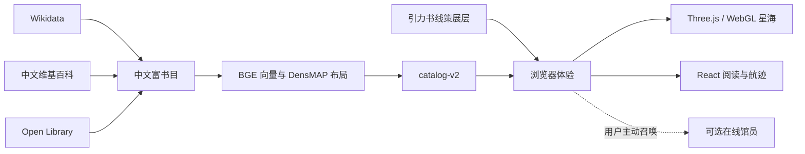

# 书架星系技术手册

书架星系由两部分组成：一个纯静态的浏览器体验，以及一条在发布前运行的数据构建流水线。模型、向量计算和数据抓取都不进入浏览器；线上应用只读取已经检查、固定版本并带归属信息的快照。

## 系统总览



### 浏览器运行时

- **React 19** 管理入口、选书、航迹、偏航罗盘、书籍观测台和星图状态。
- **Three.js / WebGL2** 渲染书星、星云、尘埃、拾取、镜头飞行和关系线。
- **catalog-v2** 提供书目、三维坐标、星体参数和可漫游关系；加载不完整时应用会失败关闭，而不是伪装成正式星海。
- **本地优先**：搜索、书目阅读、偏航、航迹和星图导出不依赖远程 AI。
- **可选在线馆员**只在用户主动召唤时调用配置的端点，不参与正式书目、坐标或关系图谱生成。

### 三种关系层

1. **语义导航关系**决定附近、过桥与远行，用于位置和航向，不承担文学解读。
2. **引力书线**是独立的 `reading-hypothesis` 策展层，用于提出两本书之间可继续追问的阅读假说。
3. **在线馆员回答**是一次性的开放解释，不写回数据快照，也不改变星海结构。

三层在数据、界面和检查器中保持分离，避免把模型近邻误写成作者影响或文学史事实。完整的方法与证据边界见 [数据来源与方法](../data-sources.md)。

## 数据流水线

### 1. 富书目

```bash
npm run build:data:rich
```

`scripts/build-rich-catalog.mjs` 从 Wikidata、中文维基百科和 Open Library 获取候选，执行作品资格、中文内容、来源与封面检查，生成：

```text
data/rich/books.json
data/rich/eligibility-report.json
```

网络缓存位于 `data/raw/rich-catalog/`，不会提交到仓库。

### 2. 语义布局

```bash
npm run build:data:layout
```

`scripts/build-semantic-layout.py` 使用 `BAAI/bge-small-zh-v1.5` 生成中文书目向量，再通过 cosine kNN 和 DensMAP 构建三维布局、局部密度、星体参数与关系候选：

```text
data/rich/layout.json
```

布局使用固定参数和 seed。调整模型、邻居数或布局参数后，必须重新生成并执行完整检查。

### 3. 正式快照与归属

```bash
npm run build:data:assemble
```

合并阶段重新校验富书目和布局，写入：

```text
public/data/catalog.json
public/data/manifest.json
public/data/ATTRIBUTION.json
```

`manifest.json` 保存当前快照的书数、关系数、模型、参数与 SHA-256；`ATTRIBUTION.json` 保存逐本来源和固定修订回链。

### 一步重建

数据重建需要 Python 3.11+：

```bash
python -m pip install -r requirements-data.txt
npm run build:data
```

## 本地开发

需要 Node.js 20.19+ 或 22.12+。

```bash
npm ci
npm run dev
```

常用命令：

```bash
npm test           # Vitest
npm run typecheck  # TypeScript
npm run build      # 生产构建
npm run preview    # 本地预览 dist
npm run check      # 完整发布检查
```

## 发布检查

`npm run check` 依次覆盖：

- 单元测试；
- 作品资格、富书目、布局、catalog 与归属检查；
- 引力书线的真实 QID、去重、全书覆盖和文案检查；
- 公开产品文案检查；
- TypeScript 与生产构建。

数据检查也可以单独运行：

```bash
npm run check:data
npm run check:curated
npm run check:copy
```

CI 以 `npm run check` 为唯一发布门槛。

## 可选在线馆员

未配置端点时，应用保持完整可用，只隐藏在线追问入口。

```dotenv
VITE_AI_ENDPOINT=https://your-domain.example/api/curator
```

端点接收当前问题、出发书、抵达书和最近航迹，并返回：

```json
{ "answer": "一段不超过 900 个字符的解释" }
```

浏览器不会保存或暴露模型密钥。服务端应自行处理鉴权、限流和内容安全；`.env` 不应提交到仓库。

## 静态部署

应用没有必需后端。执行：

```bash
npm ci
npm run check
```

随后发布 `dist/` 即可。当前仓库由 `.github/workflows/deploy-pages.yml` 在 `main` 更新后构建并部署到 GitHub Pages。Vite 使用相对 `base`，也可部署到 Cloudflare Pages、Netlify 或其他静态托管服务。

## 馆藏数据适配

`src/data/libraryAdapter.ts` 提供纯函数 `normalizeLibraryRecord()`，用于把常见 CSV/JSON 馆藏字段整理为应用的 `Book` 契约。它只负责字段规范化，不代表当前版本已经连接真实图书馆，也不替代馆藏授权、版本去重或个人数据治理。

接入真实馆藏时，应先确定作品、版本与副本的 ID 层级，并重新审查摘要、封面、借阅字段和关系生成的许可边界。

## 仓库结构

```text
public/data/                 正式 catalog、manifest 与字段级归属
data/rich/                   富书目、资格报告与语义布局快照
data/raw/                    本地网络缓存；不提交
scripts/lib/                 共享作品资格策略
scripts/                     数据构建、合并、归属与检查脚本
src/ai/                      可选在线馆员客户端
src/app/                     体验状态机、航迹与取消控制
src/components/              入口、观测台、罗盘、馆员与星图界面
src/data/                    数据载入、适配器、体验入口与引力书线
src/galaxy/                  Three.js 场景、着色器、拾取与镜头
src/lib/                     声音、星图导出、确定性计算与测试
docs/                        架构说明与视觉预览
```

## 相关文档

- [README](../README.md) — 项目故事与最快体验路径
- [数据来源与方法](../data-sources.md) — 筛选、语义布局、关系与审计
- [数据归属与许可](../DATA_LICENSE.md) — 字段级来源与再分发责任
- [MIT License](../LICENSE) — 项目代码许可
